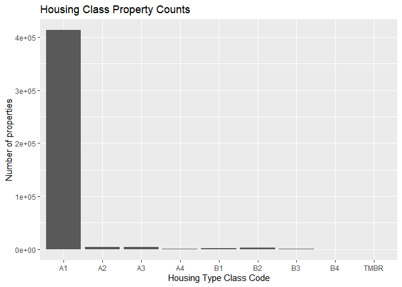
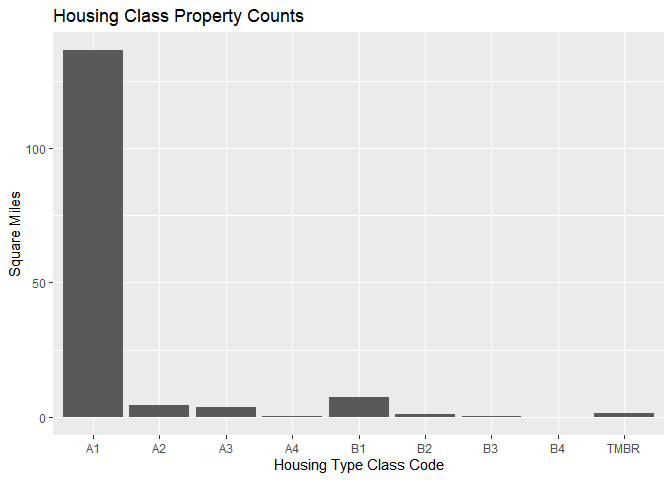
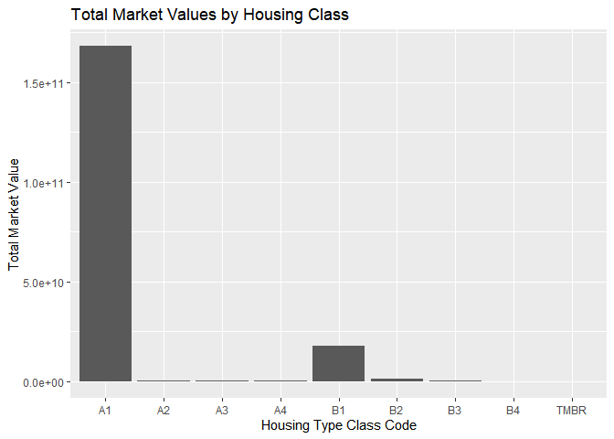

HCAD_2024_housing_summary
================
Julian Joseph
2025-01-13

``` r
require(tidyverse)
```

    ## Loading required package: tidyverse

    ## Warning: package 'tidyverse' was built under R version 4.4.2

    ## Warning: package 'ggplot2' was built under R version 4.4.2

    ## Warning: package 'tibble' was built under R version 4.4.2

    ## Warning: package 'tidyr' was built under R version 4.4.2

    ## Warning: package 'readr' was built under R version 4.4.2

    ## Warning: package 'purrr' was built under R version 4.4.2

    ## Warning: package 'dplyr' was built under R version 4.4.2

    ## Warning: package 'stringr' was built under R version 4.4.2

    ## Warning: package 'forcats' was built under R version 4.4.2

    ## Warning: package 'lubridate' was built under R version 4.4.2

    ## ── Attaching core tidyverse packages ──────────────────────── tidyverse 2.0.0 ──
    ## ✔ dplyr     1.1.4     ✔ readr     2.1.5
    ## ✔ forcats   1.0.0     ✔ stringr   1.5.1
    ## ✔ ggplot2   3.5.1     ✔ tibble    3.2.1
    ## ✔ lubridate 1.9.4     ✔ tidyr     1.3.1
    ## ✔ purrr     1.0.2

    ## ── Conflicts ────────────────────────────────────────── tidyverse_conflicts() ──
    ## ✖ dplyr::filter() masks stats::filter()
    ## ✖ dplyr::lag()    masks stats::lag()
    ## ℹ Use the conflicted package (<http://conflicted.r-lib.org/>) to force all conflicts to become errors

``` r
require(stringr)
require(ggplot2)
require(dplyr)
```

filter data for housing class types

``` r
Housing_2024 <- read.csv('C:\\urban_developement\\Portfolio\\HCAD\\real_acct_2024.txt', sep="\t", header=T) %>% 
  mutate(land_ar_mi=land_ar*3.58701e-8, tot_mkt_val=na_if(tot_mkt_val,0)) %>%
  filter(str_detect(state_class,'^A|B')) %>% 
  filter(land_ar>500) %>%
  filter(tot_mkt_val>1000) %>%
  filter(!str_detect(site_addr_1,"0")) 
```

    ## Warning in scan(file = file, what = what, sep = sep, quote = quote, dec = dec,
    ## : EOF within quoted string

Number of properties for each housing class. A=single-family
B=multi-family

``` r
Housing_2024 %>% ggplot(aes(x=state_class))+
  geom_histogram(stat="count")+
  labs(x= 'Housing Type Class Code', 
         y= 'Number of properties', 
         title = 'Housing Class Property Counts')
```

    ## Warning in geom_histogram(stat = "count"): Ignoring unknown parameters:
    ## `binwidth`, `bins`, and `pad`

<!-- -->
Area of each housing class

``` r
Housing_2024 %>% group_by(state_class) %>% 
  summarize(area=sum(land_ar_mi, na.rm=TRUE)) %>% 
  ggplot(aes(x=state_class)) + 
  geom_col(aes(y=area)) + 
  labs(x='Housing Type Class Code', 
       y='Square Miles', 
       title='Housing Class Property Counts')
```

<!-- -->
Market value of each housing class

``` r
Housing_2024 %>% group_by(state_class) %>% 
  summarize(area=sum(tot_mkt_val, na.rm=TRUE)) %>% 
  ggplot(aes(x=state_class)) + geom_col(aes(y=area)) + 
  labs(x='Housing Type Class Code', 
       y= 'Total Market Value', 
       title='Total Market Values by Housing Class')
```

<!-- -->
