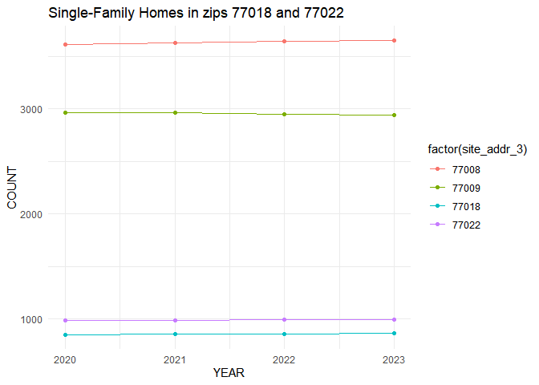

Housing_Analysis
================
Julian Joseph
2025-01-13

``` r
require(tidyverse)
```

    ## Loading required package: tidyverse

    ## Warning: package 'tidyverse' was built under R version 4.4.2

    ## Warning: package 'ggplot2' was built under R version 4.4.2

    ## Warning: package 'tibble' was built under R version 4.4.2

    ## Warning: package 'tidyr' was built under R version 4.4.2

    ## Warning: package 'readr' was built under R version 4.4.2

    ## Warning: package 'purrr' was built under R version 4.4.2

    ## Warning: package 'dplyr' was built under R version 4.4.2

    ## Warning: package 'stringr' was built under R version 4.4.2

    ## Warning: package 'forcats' was built under R version 4.4.2

    ## Warning: package 'lubridate' was built under R version 4.4.2

    ## ── Attaching core tidyverse packages ──────────────────────── tidyverse 2.0.0 ──
    ## ✔ dplyr     1.1.4     ✔ readr     2.1.5
    ## ✔ forcats   1.0.0     ✔ stringr   1.5.1
    ## ✔ ggplot2   3.5.1     ✔ tibble    3.2.1
    ## ✔ lubridate 1.9.4     ✔ tidyr     1.3.1
    ## ✔ purrr     1.0.2

    ## ── Conflicts ────────────────────────────────────────── tidyverse_conflicts() ──
    ## ✖ dplyr::filter() masks stats::filter()
    ## ✖ dplyr::lag()    masks stats::lag()
    ## ℹ Use the conflicted package (<http://conflicted.r-lib.org/>) to force all conflicts to become errors

``` r
require(stringr)
require(ggplot2)
require(dplyr)
```

Filtering and cleaning of HCAD data.

``` r
Housing_2023 <- read.csv('C:\\urban_developement\\Portfolio\\HCAD\\real_acct_2023.txt', sep="\t", header=T)  
Housing_2022 <- read.csv('C:\\urban_developement\\Portfolio\\HCAD\\real_acct_2022.txt', sep="\t", header=T) 
Housing_2021 <- read.csv('C:\\urban_developement\\Portfolio\\HCAD\\real_acct_2021.txt', sep="\t", header=T) 
Housing_2020 <- read.csv('C:\\urban_developement\\Portfolio\\HCAD\\real_acct_2020.txt', sep="\t", header=T)  
HarrisCo_housing <- rbind(Housing_2023,Housing_2022,Housing_2021,Housing_2020) %>% 
  select(-starts_with('mail'),
         -starts_with('Market'), 
         -starts_with('str'), 
         -starts_with('lgl')) %>%
  filter(str_detect(state_class,'^A|B')) %>%
  filter(!str_detect(site_addr_1,"0")) %>%
  filter(tot_mkt_val>1000) %>% 
  filter(land_ar>500) %>%
  mutate(land_ar_mi=land_ar*3.58701e-8, tot_mkt_val=na_if(tot_mkt_val,0))
```

Harris County Single-family housing counts 2020-2023. County data shows
significant increases in single family housing structures 2020-2023.
Increase over this time period likely do to high demand for housing and
reopening of supply chains.

``` r
HarrisCo_housing %>% 
  group_by(yr) %>% 
  filter(state_class=='A1') %>% 
  tally() %>% 
  mutate(
    yr=as.numeric(yr)) %>%  
  ggplot(aes(x=yr,y= n)) + 
    geom_point() + 
    geom_line() +
  labs(x='Year',
       y='Count',
       title='Harris County Single-Family Homes') +
  theme_minimal()
```

<!-- -->

Harris County Multi-family housing counts 2020-2023. The county data
reveals a notable decline in multifamily structures from 2020-2022,
possibly due to Covid-19 policy effecting data.

``` r
HarrisCo_housing %>%
  group_by(yr) %>%
  filter(state_class=='B1',na.rm=TRUE) %>%
  tally() %>%
  mutate(yr=as.numeric(yr)) %>%
  ggplot(aes(x=yr,y=n)) +
    geom_point() +
    geom_line() +
  labs(x='YEAR',
       y='COUNT',
       title='Harris County Multi-Family Homes') +
  theme_minimal()
```

<!-- -->

Multifamily counts for zip codes 77018, 77008, 77009, 77022 from
2020-2023. \#Data reveals significantly greater amount of multifamily
homes in 77008, and 77009, likely due to lack of parking minimums in
these zip codes allowing for greater density.

``` r
HarrisCo_housing %>% 
  filter(site_addr_3 %in% c(77018,77022,77008,77009)) %>%
  filter(str_detect(state_class, 'B1')) %>%
  group_by(yr,site_addr_3) %>% 
  tally(name = 'n') %>% 
  mutate(yr=as.numeric(yr)) %>%  
  ggplot(aes(x=yr,y= n, color=factor(site_addr_3))) + 
    geom_point() + 
    geom_line() +
  labs(x='YEAR',
       y='COUNT',
       title='Multi-Family Homes by Zipcode') +
  theme_minimal()
```

<!-- -->

Singlefamily counts for zip codes 77018, 77008, 77009, 77022 from
2020-2023. Notably missing are the sharp increases seen in the county
overall.

``` r
HarrisCo_housing %>% 
  filter(site_addr_3 %in% c(77018,77022,77008,77009)) %>%
  filter(str_detect(state_class, 'A1')) %>%
  group_by(yr,site_addr_3) %>% 
  tally(name = 'n') %>% 
  mutate(yr=as.numeric(yr)) %>%  
  ggplot(aes(x=yr,y= n, color=factor(site_addr_3))) + 
  geom_point() + 
  geom_line() +
  labs(x='YEAR',
       y='COUNT',
       title='Single-Family Homes in zips 77018 and 77022') +
  theme_minimal()
```

<!-- -->

Median SF market values by zip code. Median value growth for 77008
diverges from other zips in 2023 with noticeably greater growth rate.

``` r
HarrisCo_housing %>%
  filter(site_addr_3 %in% c(77018,77022,77008,77009)) %>%
  filter(tot_mkt_val>10) %>%
  filter(state_class=='A1') %>%
  group_by(yr, site_addr_3) %>%
  mutate(tot_mkt_val=median(tot_mkt_val), na.rm=TRUE) %>%
  ggplot(aes(x=yr, y=tot_mkt_val, color=factor(site_addr_3) )) +
  geom_point() +
  geom_line() +
  labs(x='YEAR',
       y='MEDIAN MARKET VALUE',
       title='Single Family Median Values by Zipcode')
```

<!-- -->

Median SF market value per square foot by zip code. 77008 growth in
value per sqft seems to show even greater outpacing of the selected zip
codes. Notable that growth for 77009 surpassing 77018 in 2023.

``` r
HarrisCo_housing %>%
  filter(site_addr_3 %in% c(77018,77022,77008,77009)) %>%
  filter(tot_mkt_val>10) %>%
  filter(str_detect(state_class,'^A')) %>%
  group_by(yr,site_addr_3) %>%
  mutate(tot_mkt_val=median(tot_mkt_val/land_ar),na.rm=TRUE) %>%
  ggplot(aes(x=yr, 
             y=tot_mkt_val,
             color=factor(site_addr_3))) +
  geom_point() +
  geom_line() +
  labs(x='YEAR',
       y='VALUE / SQFT',
       title = 'Single-Family Median Market Value per Square Foot by Zipcode') +
  theme_minimal()
```

<!-- -->

## R Markdown

This is an R Markdown document. Markdown is a simple formatting syntax
for authoring HTML, PDF, and MS Word documents. For more details on
using R Markdown see <http://rmarkdown.rstudio.com>.

When you click the **Knit** button a document will be generated that
includes both content as well as the output of any embedded R code
chunks within the document. You can embed an R code chunk like this:

``` r
summary(cars)
```

    ##      speed           dist       
    ##  Min.   : 4.0   Min.   :  2.00  
    ##  1st Qu.:12.0   1st Qu.: 26.00  
    ##  Median :15.0   Median : 36.00  
    ##  Mean   :15.4   Mean   : 42.98  
    ##  3rd Qu.:19.0   3rd Qu.: 56.00  
    ##  Max.   :25.0   Max.   :120.00

## Including Plots

You can also embed plots, for example:

<!-- -->

Note that the `echo = FALSE` parameter was added to the code chunk to
prevent printing of the R code that generated the plot.
